<p align="center">
  <picture>
    <source media="(prefers-color-scheme: dark)" srcset="docs/banner-dark.svg">
    
  </picture>
</p>

# DeepSeek Harness Desktop

[](https://github.com/HaoyueQin/deepseek-harness-desktop/releases)
[](https://github.com/HaoyueQin/deepseek-harness-desktop/actions)
[](https://github.com/HaoyueQin/deepseek-harness-desktop/stargazers)
[](LICENSE)
[](https://github.com/HaoyueQin/deepseek-harness-desktop/issues)
[]()
[](https://github.com/HaoyueQin/deepseek-harness-desktop/graphs/commit-activity)
[](https://github.com/HaoyueQin/deepseek-harness-desktop/commits)

A desktop shell for [DeepSeek Harness](https://github.com/deepseek-ai/deepseek-harness) — the pluggable AI agent harness from DeepSeek. Wrap the official `dsh web` UI into a native-feeling, always-on desktop app, **reusing the `dsh` CLI you already have**.

<p align="center">
  
</p>

English | [简体中文](README.zh.md)

## Features

### Backend (dsh) integration

- **Dual backend sources** — run the `dsh` from your npm global install (stable channel) or from a local git checkout (any version, including pre-releases), switchable in Settings. `Auto` mode prefers npm and falls back to the source directory; if the chosen source breaks, the shell falls back to the other one and tells you why
- **Zero-intrusion wrapper** — spawns the chosen `dsh` as a child process (`dsh web`), loads its localhost UI; the harness source is never modified. One dsh shared by terminal and desktop — plugins, settings, credentials, sessions and versions always match (`DSH_HOME`, default `~/.dsh`)
- **Source mode without terminals** — pick a folder and the shell drives everything: clone the official repo, run `pnpm install` + `pnpm build` with live logs, validate the result, then boot. The only prerequisites are `git` and `pnpm` on PATH
- **Source-mode updates like npm's** — check the upstream tags, see "current → latest", then one click checks out the tag, reinstalls, rebuilds and restarts the backend. Dirty worktrees are refused with a clear message
- **One proxy for every update channel** — a single proxy setting covers git (clone/fetch), pnpm (install/build) and npm (check/upgrade); git uses per-invocation config, never touching your global gitconfig
- **First-run setup page** — no dsh detected? The app offers a copyable install command, a one-click in-app install, or the source-mode path (clone + prepare), then boots automatically
- **In-app dsh updates (npm channel)** — Settings → Desktop shows your dsh version; one click checks npm for the latest release and upgrades it (no terminal needed)

### Desktop experience

- **Frameless immersive window** — no native title bar; the custom window controls (minimize / maximize / close) blend into the page with DeepSeek brand-blue hover and follow the light/dark theme
- **Always-on tray** — closing the window hides to the system tray instead of quitting; the backend keeps running for instant resume
- **Auto-start at login** — toggle in the tray menu (Windows/macOS native; Linux via XDG autostart)
- **Configurable port policy** — fixed `3080` by default (same as `dsh web`, giving a stable page origin so browser-side preferences survive restarts), switchable to a custom port or random in Settings; falls back to a random port with a notice when the fixed port is taken. Note: while the shell lives in the tray it holds the port — run `dsh web --port <other>` in a terminal to coexist
- **Single instance** — launching again focuses the existing window
- **Full plugin freedom** — dynamic plugins (`cordis_define`/`cordis_run`), `$DSH_HOME/cordis.patch.yml`, and the npm plugin ecosystem all work exactly as in the web edition
- **Desktop settings section** — the app's Settings page gains a "Desktop" tab (styled to match the harness UI): backend source card (mode, directory validation, clone/prepare, proxy), dsh version card (source-aware check & update with live logs), shell self-update check, auto-start toggle, launch-minimized toggle, port policy, About card
- **Conversation width, natively** — on dsh ≥ 0.1.2-alpha.1 the shell stays out of the way and the upstream drag handles do the job; on older backends the shell replicates the same handles (same range, same persistence key), so upgrades hand your preference over seamlessly
- **Shell self-update (two-step)** — checks silently 15s after launch (detection only, never auto-downloads): a "Download update" button appears in Settings, switching to "Install update" once downloaded — every step is triggered by you. Windows installs by quitting and running the installer (unsigned builds can't install silently); Linux AppImage replaces itself automatically; macOS excluded (needs signing)

## Screenshots


| General desktop options | Backend source, proxy and updates |
| --- | --- |
|  |  |

## Install

### Prerequisites

- **npm channel (default)**: Node.js ≥ 22 and the `dsh` CLI (`npm i -g @deepseek-ai/dsh`) — if missing, the app shows a setup page with a copyable command or a one-click in-app install
- **Source channel (optional)**: additionally requires `git` and `pnpm` on PATH; the shell clones the repo and runs `pnpm install` + `pnpm build` for you

### Download

Download the installer for your platform from the [Releases](https://github.com/HaoyueQin/deepseek-harness-desktop/releases) page:

| Platform | Package | Notes |
| --- | --- | --- |
| Windows | `deepseek-harness-desktop-<ver>-setup.exe` | NSIS installer, x64 |
| macOS | `.dmg` (Apple Silicon / Intel) | unsigned — first run: right-click → Open |
| Linux | `.AppImage` + `.deb` | x64 |

### First launch

1. Start the app — it resolves your backend (npm by default), boots `dsh web` in the background and opens the UI at its ready state (no dsh? you'll see the setup page first)
2. Dismiss the **预览版 / preview** notice
3. Open **Settings → Models** and configure your LLM provider (API key, model, base URL) — same as the web edition
4. Pick a workspace and start chatting

### Everyday use

- **Close window** → app hides to the tray, backend keeps running (a DeepSeek whale icon appears near the system clock)
- **Tray menu** (right-click the icon): reopen the window, toggle auto-start at login, or quit — quitting fully stops the backend
- **Quit via tray** is the only way to exit the app; closing the window never does

## Development

```sh
npm install        # installs electron 43 + toolchain
npm run dev        # dev mode: system Node + your chosen backend (npm or source dir)
```

> **electron binary download stuck?** (you see `Downloading Electron binary...` forever)
> GitHub-hosted binaries can be slow from some networks. Manually fetch
> `https://npmmirror.com/mirrors/electron/<version>/electron-v<version>-win32-x64.zip` into
> `%LOCALAPPDATA%\electron\Cache\electron-v<version>-win32-x64\`, then:
> ```sh
> printf "electron.exe" > node_modules/electron/path.txt
> # and unzip the archive into node_modules/electron/dist/
> ```

## Packaging

```sh
npm run build:runtime     # generates resources/icon.png (+ build/icon.png) from the upstream favicon
npm run dist:win          # Windows NSIS installer → release/
# npm run dist:mac        # macOS dmg (requires macOS; CI builds it)
# npm run dist:linux      # Linux AppImage + deb
```

The CI workflow (`.github/workflows/release.yml`) builds all three platforms on every `v*` tag and publishes the artifacts to a GitHub Release.

## Data & logs

- **Data** (`DSH_HOME`): defaults to `~/.dsh` (honors the `$DSH_HOME` environment variable) — profiles, sessions, storage; shared by both backend sources
- **Logs**: `<userData>/logs/main.log`
- **dsh**: the shell runs the backend from your chosen source — npm global (located via PATH + `npm root -g`, upgradable from Settings → Desktop) or a local checkout (validated for `apps/cli`, `node_modules/tsx` and the built web dist before launch)

## Project layout

```
src/
  main.ts               app lifecycle: single-instance lock, window, tray, backend resolution, setup page
  paths.ts              dev/prod resource resolution (icon, preload, desktop plugin patch)
  dsh-locator.ts        locate the npm-global dsh CLI (PATH check + npm root -g) + semver compare
  dsh-source.ts         git-checkout source: validation (manifest/tsx/web dist), tag parsing, entry args
  dsh-source-updater.ts source-channel updates: fetch tags → clean tree → checkout → pnpm install/build → restart
  dsh-updater.ts        npm-channel backend: check npm latest / one-click npm i -g upgrade
  settings.ts           shell settings (userData/settings.json — backend source, source dir, proxy, port policy)
  updater.ts            electron-updater (Windows guided / Linux AppImage auto)
  dsh/spawn.ts          spawn dsh web --port <policy port> --patch; parse stdout URL line; graceful stop
  dsh/ready.ts          HTTP readiness probe (any status — the URL may carry a process token since 0.1.2-alpha.1)
  tray.ts               tray menu (open / auto-start / quit) + autostart sync
  autostart.ts          auto-start (native on win/mac; XDG file on linux)
  preload.ts            contextBridge bridge (window controls + desktop IPC; compiled to CJS)
scripts/
  install-runtime.mjs   generates resources/icon.png at build time (from upstream favicon)
  smoke.mjs             headless smoke test: spawn dsh, assert URL line + HTTP response
resources/
  desktop-integration/  settings "Desktop" section plugin (dsh browser half)
  desktop-patch.yml     shell-injected patch mounting the plugin
assets/
  wordmark.svg          project wordmark
```

## Known limitations (v1.x)

- Requires Node.js ≥ 22; the npm channel needs a globally-installed `dsh` CLI (the setup page offers one-click install), the source channel needs `git` + `pnpm` — the shell bundles no runtime either way, so the installer stays small
- macOS builds are unsigned — Gatekeeper requires right-click → Open on first run; macOS has no auto-update (needs a signing certificate)
- Windows auto-update is guided (downloads then runs the installer) rather than silent, due to the unsigned build
- The source channel checks out release tags in detached HEAD — switch your branch back manually if you develop in the same clone

## Feedback

Found a bug? Have a feature idea? **Issues are very welcome** — bug reports, usage questions, and suggestions all help.

- [Open an issue](https://github.com/HaoyueQin/deepseek-harness-desktop/issues) (English or 中文, either is fine)
- For harness-level problems, also check upstream [deepseek-harness discussions](https://github.com/deepseek-ai/deepseek-harness/discussions)

## Activity

[](https://gitstock.org/HaoyueQin/deepseek-harness-desktop)

## License

[MIT](LICENSE). The DeepSeek Harness itself is [MIT](https://github.com/deepseek-ai/deepseek-harness) © DeepSeek AI.
