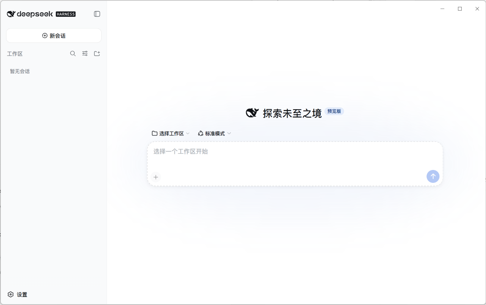
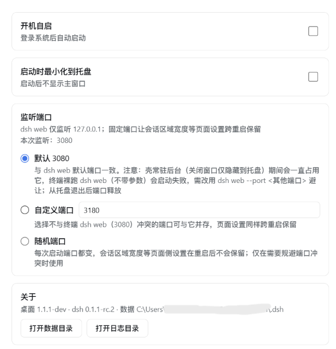
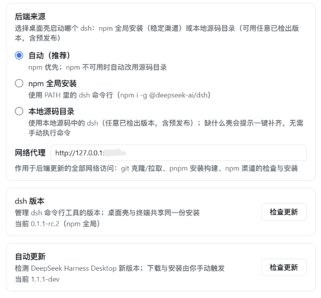

<p align="center">
  <picture>
    <source media="(prefers-color-scheme: dark)" srcset="docs/banner-zh-dark.svg">
    
  </picture>
</p>

# DeepSeek Harness Desktop

[English](README.md) | 简体中文

[](https://github.com/HaoyueQin/deepseek-harness-desktop/releases)
[](https://github.com/HaoyueQin/deepseek-harness-desktop/actions)
[](https://github.com/HaoyueQin/deepseek-harness-desktop/stargazers)
[](LICENSE)
[](https://github.com/HaoyueQin/deepseek-harness-desktop/issues)
[]()
[](https://github.com/HaoyueQin/deepseek-harness-desktop/graphs/commit-activity)
[](https://github.com/HaoyueQin/deepseek-harness-desktop/commits)

为 [DeepSeek Harness](https://github.com/deepseek-ai/deepseek-harness)（DeepSeek 开源的可插拔 AI Agent harness）打造的桌面应用壳，把官方 `dsh web` 界面包装成原生质感、常驻后台的桌面应用，**直接复用你已安装的 `dsh` 命令行工具**。

<p align="center">
  
</p>

## 特性

### 后端（dsh）集成

- **双后端来源** — 使用 npm 全局安装的 dsh（稳定渠道）或本地 git 源码目录中的 dsh（任意已检出版本，含预发布），设置页随时切换。「自动」模式 npm 优先、源码目录兜底；所选来源失效时自动回退另一来源，并明确告知原因
- **零侵入包装** — 以子进程方式运行所选的 dsh（`dsh web`），加载其 localhost 界面；harness 源码零改动。终端与桌面端共用同一份 dsh——插件、设置、凭证、会话与版本永远一致（`DSH_HOME`，默认 `~/.dsh`）
- **源码模式无需终端** — 选一个文件夹，剩下的壳来驱动：克隆官方仓库、跑 `pnpm install` + `pnpm build`（实时日志）、校验产物、然后启动。环境要求只有 PATH 里的 `git` 与 `pnpm`
- **源码渠道更新对齐 npm 渠道** — 核对上游 tag、展示「当前 → 最新」，一键完成检出 tag、重装依赖、重新构建并重启后端；工作区有未提交修改时拒绝并明确提示
- **一个代理覆盖全部更新通道** — 单独一处代理设置同时作用于 git（克隆/拉取）、pnpm（安装/构建）与 npm（检查/升级）；git 走本次调用的临时配置，绝不改动全局 gitconfig
- **首次启动引导安装** — 未检测到 dsh？应用提供可复制的安装命令、壳内一键安装，或源码安装路径（克隆 + 准备环境），装完自动进入
- **版本检查留在桌面，更新进恢复中心** — 设置 → 桌面检查 dsh 新版（npm/git 双来源）；确认更新后交接给壳原生恢复中心，实时显示进度，完成后自动重启后端

### 桌面体验

- **无边框沉浸窗口** — 无原生标题栏；自绘窗口控制按钮（最小化/最大化/关闭）以 DeepSeek 品牌蓝 hover 融入页面，并随明暗主题切换
- **托盘常驻** — 关闭窗口隐藏到系统托盘而非退出，后端持续运行，随时秒开
- **开机自启** — 托盘菜单一键开关（Windows/macOS 原生实现；Linux 走 XDG autostart）
- **端口策略可配** — 默认固定 `3080`（与 `dsh web` 一致，页面 origin 稳定，浏览器侧设置跨重启保留），设置页可改为自定义端口或随机；固定端口被占时自动降级随机并提示。注意：壳常驻托盘期间占用该端口，终端裸跑 `dsh web` 需带 `--port` 避让
- **单实例** — 重复启动会聚焦已有窗口
- **插件自由不受限** — 动态插件（`cordis_define`/`cordis_run`）、`$DSH_HOME/cordis.patch.yml`、npm 插件生态均与 Web 版完全一致
- **设置页桌面分区** — 设置页新增「桌面」标签页（UI 契合 harness 设计）：后端来源卡片（来源模式、目录校验、克隆/准备环境、网络代理）、dsh 版本卡片（按来源区分的检查；确认更新后交接恢复中心，实时进度）、桌壳自身更新检查、开机自启开关、启动最小化开关、端口策略、关于卡片
- **会话区域宽度，原生体验** — 支持的 dsh 版本上完全由上游原生拖拽手柄接管，壳不注入任何实现
- **桌壳自更新（两段式）** — 启动 15 秒后静默检查（只发现新版本，绝不自动下载）：设置页出现「下载更新」按钮，下载完成变「安装更新」，每一步都由你显式触发；Windows 安装即退出并运行安装包（未签名无法静默安装），Linux AppImage 自动替换；macOS 暂不支持（需签名）

## 界面预览



| 桌面通用选项 | 后端来源、代理与更新 |
| --- | --- |
|  |  |

## dsh 版本支持

| dsh 版本 | 使用 |
| --- | --- |
| **≥ 0.1.2-rc.1** | 本版本桌面壳 |
| 更旧的任意版本（0.1.0/0.1.1、各 alpha） | 下载**旧版本桌面壳**——见 [Releases](https://github.com/HaoyueQin/deepseek-harness-desktop/releases) 页面 |

本桌面壳不再适配 0.1.2-rc.1 之前的 dsh 版本。用 `dsh --version` 自查后端版本；
若过旧，可升级 dsh（`npm i -g @deepseek-ai/dsh@next`——当前 0.1.2-rc.1 发布在 npm `next` 渠道；
或在支持的桌面壳上通过设置页「检查更新」升级），**或**下载匹配的旧版桌面壳。

## 安装

### 前置条件

- **npm 渠道（默认）**：Node.js ≥ 22 与 dsh CLI（`npm i -g @deepseek-ai/dsh`）——若未安装，应用会显示引导页，提供可复制命令或壳内一键安装
- **源码渠道（可选）**：额外要求 PATH 里有 `git` 与 `pnpm`；克隆仓库与 `pnpm install` + `pnpm build` 均由壳代劳

### 下载

从 [Releases](https://github.com/HaoyueQin/deepseek-harness-desktop/releases) 下载对应平台的安装包：

| 平台 | 安装包 | 说明 |
| --- | --- | --- |
| Windows | `deepseek-harness-desktop-<ver>-setup.exe` | NSIS 安装包，x64 |
| macOS | `.dmg`（Apple Silicon / Intel） | 未签名 — 首次运行需右键 → 打开 |
| Linux | `.AppImage` + `.deb` | x64 |

### 首次启动

1. 启动应用 — 自动解析生效后端（默认 npm），后台启动 `dsh web` 服务，界面就绪后自动打开（未装 dsh 会先进入引导安装页）
2. 关闭「预览版」提示
3. 打开 **设置 → 模型** 配置你的 LLM 供应商（API Key、模型、Base URL），与 Web 版一致
4. 选择一个工作区，开始对话

### 日常使用

- **关闭窗口** → 应用隐藏到托盘（系统时钟附近出现 DeepSeek 鲸鱼图标），后端继续运行
- **托盘菜单**（右键点击图标）：重新打开窗口、开关开机自启、退出 — 只有「退出」才会真正停止后端
- **只能通过托盘退出**；关闭窗口永远不会退出应用

## 开发

```sh
npm install        # 安装 electron 43 及工具链
npm run dev        # dev 模式：系统 Node + 你所选的后端（npm 或源码目录）
```

> **electron 二进制下载卡住？**（一直显示 `Downloading Electron binary...`）
> GitHub 托管的二进制在某些网络下很慢。可手动下载
> `https://npmmirror.com/mirrors/electron/<版本>/electron-v<版本>-win32-x64.zip` 放入
> `%LOCALAPPDATA%\electron\Cache\electron-v<版本>-win32-x64\`，然后：
> ```sh
> printf "electron.exe" > node_modules/electron/path.txt
> # 并把 zip 解压到 node_modules/electron/dist/
> ```

## 打包

```sh
npm run build:runtime     # 从上游 favicon 生成 resources/icon.png（+ build/icon.png）
npm run dist:win          # Windows NSIS 安装包 → release/
# npm run dist:mac        # macOS dmg（需 macOS 环境；CI 负责构建）
# npm run dist:linux      # Linux AppImage + deb
```

CI 工作流（`.github/workflows/release.yml`）在每个 `v*` tag 上构建全平台产物并自动发布到 GitHub Release。

## 数据与日志

- **数据**（`DSH_HOME`）：默认 `~/.dsh`（尊重 `$DSH_HOME` 环境变量）— profile、会话、存储；两种后端来源共享
- **日志**：`<userData>/logs/main.log`
- **dsh**：壳从你所选的来源运行后端 — npm 全局（PATH + `npm root -g` 定位，可在设置 → 桌面一键升级）或本地检出（启动前校验 `apps/cli`、`node_modules/tsx` 与已构建的前端 dist）

## 项目结构

```
src/
  main.ts               应用生命周期：单实例锁、窗口、托盘、后端解析、引导页
  paths.ts              dev/prod 资源路径解析（图标、preload、桌面插件 patch）
  dsh-locator.ts        定位 npm 全局的 dsh CLI（PATH 验证 + npm root -g）+ semver 比较
  dsh-source.ts         git 源码来源：目录校验（manifest/tsx/web dist）、tag 解析、启动参数
  dsh-source-updater.ts 源码渠道更新：拉取 tag → 干净工作区 → 检出 → pnpm install/build → 重启
  dsh-updater.ts        npm 渠道后端：检查 npm 最新版 / 一键 npm i -g 升级
  settings.ts           壳设置（userData/settings.json — 后端来源、源码目录、代理、端口策略）
  updater.ts            electron-updater（Windows 引导 / Linux AppImage 全自动）
  dsh/spawn.ts          spawn dsh web --port <策略端口> --patch，解析 stdout URL 行，优雅停止
  dsh/ready.ts          HTTP 就绪探测（任意状态——支持的 dsh 的 URL 带进程 token）
  tray.ts               托盘菜单（打开 / 开机自启 / 退出）+ 自启勾选同步
  autostart.ts          开机自启（win/mac 原生 + linux XDG 文件）
  preload.ts            contextBridge 桥（窗口控制 + 桌面 IPC；编译为 CJS）
scripts/
  install-runtime.mjs   从上游 favicon 生成 resources/icon.png
  smoke.mjs             无 GUI 冒烟：spawn dsh，断言 URL 行 + HTTP 有响应
resources/
  desktop-integration/  设置页「桌面」分区插件（dsh 浏览器 half）
  desktop-patch.yml     壳注入的 patch（挂载该插件）
assets/
  wordmark.svg          项目标识
```

## 已知限制（v1.x）

- 需要 Node.js ≥ 22 与 **dsh ≥ 0.1.2-rc.1**；npm 渠道需全局安装 dsh CLI（引导页提供一键安装），源码渠道需 `git` + `pnpm`——两种方式壳都不内置运行时，安装包保持小巧。更旧的 dsh 版本需要旧版桌面壳（见上方 dsh 版本支持表）
- macOS 构建未签名 — Gatekeeper 首次运行需右键 → 打开；macOS 暂不支持自动更新（需签名证书）
- Windows 自动更新为引导模式（下载后运行安装包）而非静默安装，源于未签名构建
- 源码渠道以 detached HEAD 检出发布 tag——如果你在同一克隆里做开发，更新后需手动切回工作分支

## 反馈

发现 Bug？有功能想法？**非常欢迎提交 issue** — 问题报告、使用疑问、功能建议都行。

- [新建 issue](https://github.com/HaoyueQin/deepseek-harness-desktop/issues)（中文或 English 均可）
- harness 本身的问题，可同步查阅上游 [deepseek-harness discussions](https://github.com/deepseek-ai/deepseek-harness/discussions)

## 活跃度

[](https://gitstock.org/HaoyueQin/deepseek-harness-desktop)

## 许可

[MIT](LICENSE)。DeepSeek Harness 本体为 [MIT](https://github.com/deepseek-ai/deepseek-harness) © DeepSeek AI。
